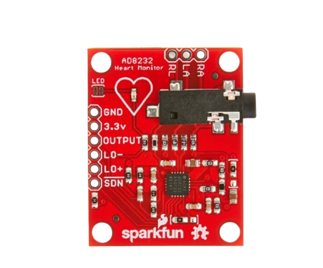
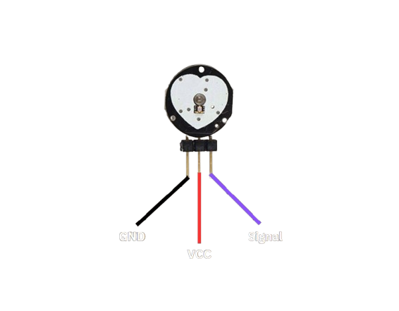
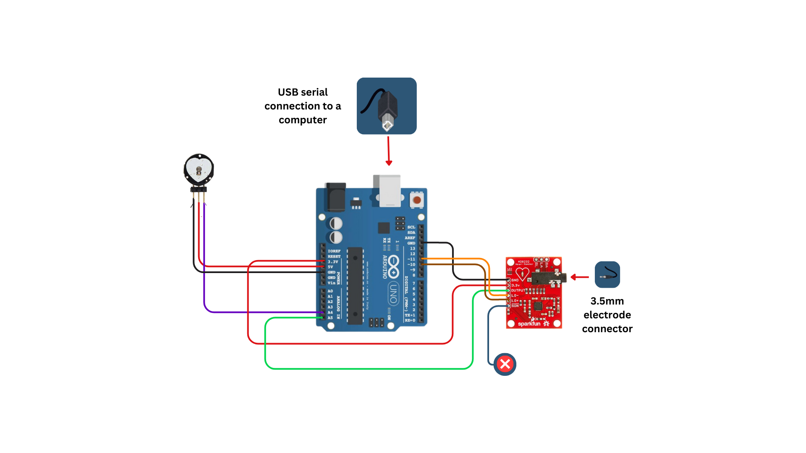
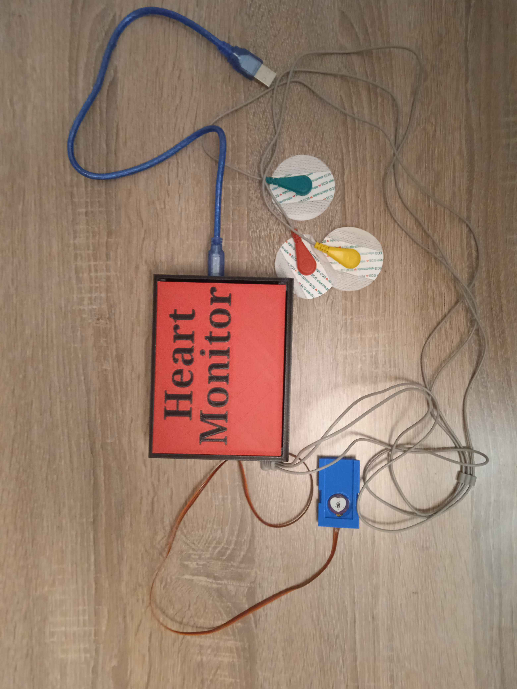
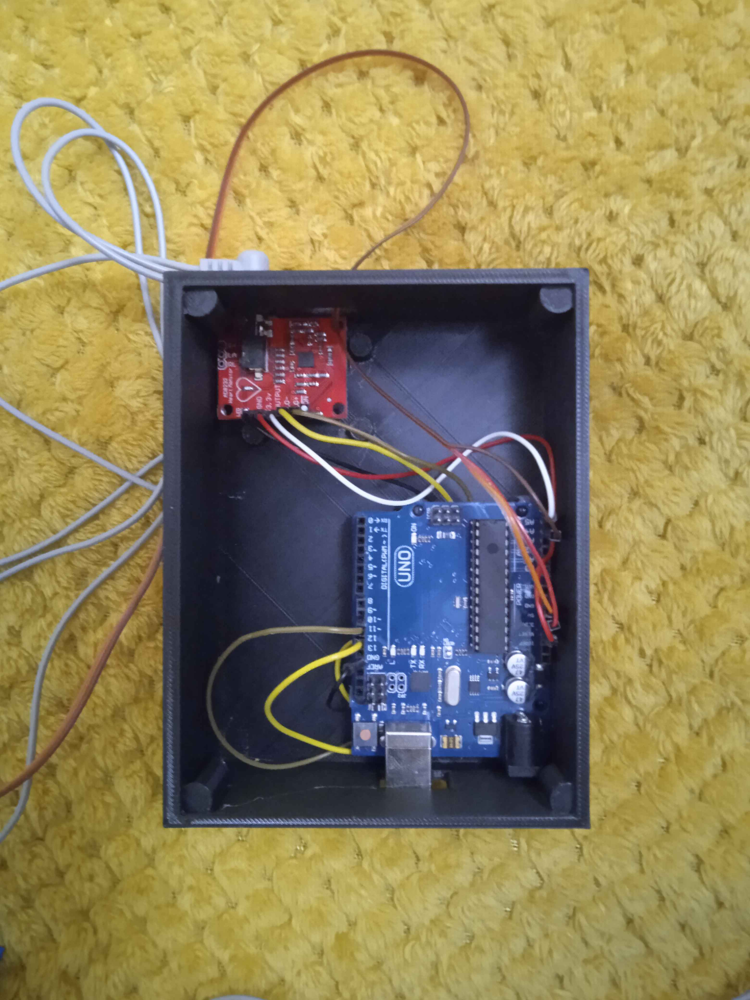
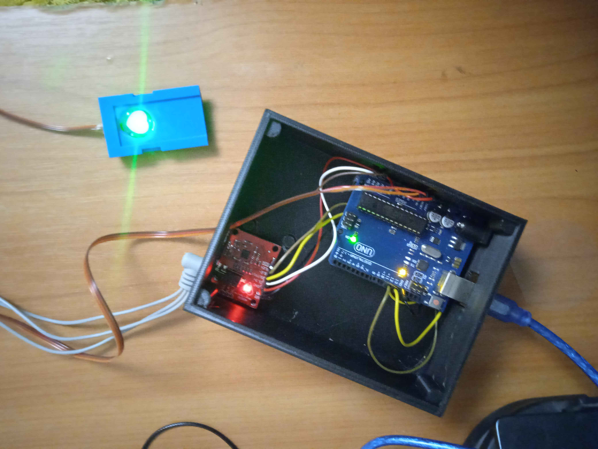

# Introduction
This heart monitor is built with the AD8232 ECG module and a Pulse Sensor to track heart activity in real-time. It provides output as a sine-like signal, representing heartbeats and ECG waveforms. Primarily a learning project, it explores biosignal processing and heart signal interpretation. Understanding ECG signals helps analyze heart health by identifying peaks (R-waves) and rhythms.

## Table of Contents
- [Introduction](#introduction)
-[How does the heart work?](#how-does-the-heart-work?)
- [Hardware Requirements](#hardware-requirements)
- [How does each module work?](#how-does-each-module-work?)
    - [AD8232 ECG sensor](#ad8232-ecg-sensor)
    - [Pulse sensor](#pulse-sensor)
- [Installation](#installation)
- [Assembled Product](#assembled-product)
- [Usage](#usage)
- [Commands](#commands)
- [Example Outputs](#example-outputs)
- [Troubleshooting](#troubleshooting-and-problems)
- [License](#license)
# How does the heart work?
Pack your bags everyone, we are going back to class for some learning 📚📚👨‍🎓

## 1. Heres the start

Your heart is like a **pump** that moves blood around your body. But instead of someone turning it on, your heart runs on **tiny electrical signals** that tell it when to squeeze (contract) and relax. These signals make sure your heart keeps a steady rhythm, just like a drum beat in a song.

### 1.1 The Heart's Electrical Pathway 🏃⚡

Think of your heart as a **race track** where an electrical signal runs in a specific order:

1. **Sinoatrial (SA) Node** – This is like the **starter pistol** at the beginning of the race. It tells your heart to start a beat.
2. **Atrioventricular (AV) Node** – The signal runs here next and takes a tiny pause, giving time for the heart’s top chambers (atria) to squeeze and push blood downward.
3. **Bundle of His** – The signal zooms down a track that splits into two, heading toward the lower heart chambers (ventricles).
4. **Purkinje Fibers** – The final stretch! The signal spreads like lightning, making the ventricles squeeze and send blood to the lungs and the rest of your body.

Without this **electrical race**, your heart wouldn’t know when to beat!

#### 🔍 Picture of How the Signal Moves in Your Heart:


---

## 2. What Is an ECG, and What Do the Waves Mean?

A **heart monitor (ECG)** is like a **graph** that draws pictures of your heart’s electrical signals. Each bump and dip in the graph tells us something about how your heart is working.

### 2.1 What Do the ECG Waves Mean? 📈

Imagine your heart’s electrical signal is like a roller coaster. Each part of the ride means something:

- **P Wave** – This is like the climb to the top. It shows your heart’s top chambers (atria) getting ready to squeeze.
- **QRS Complex** – This is the big drop! It shows your lower chambers (ventricles) squeezing hard to pump blood.
- **T Wave** – This is the part of the ride where things calm down. Your heart is **resetting** and getting ready for the next beat.

#### 🔍 Picture of an ECG Wave:


### 2.2 What Can an ECG Tell Us? ❓

A normal ECG has a smooth and steady pattern. But if the waves look **too fast, too slow, or strange**, it might mean there’s a heart problem. Here are some examples:

- **Atrial Fibrillation** – The P wave looks messy, meaning the top part of the heart isn’t working smoothly.
- **Ventricular Tachycardia** – The QRS spikes are huge and too fast, showing the heart is **racing** too much.
- **Heart Attack (Myocardial Infarction)** – The line between the waves is **too high**, showing a part of the heart isn’t getting enough blood.

#### 🔍 Picture of Different ECG Patterns:


---

## 3. Why Is This Important?

If you’ve ever seen a **hospital heart monitor**, that’s an ECG in action! Doctors use it to check if your heart is working correctly. 
This introduction is also **necessary**for you to understand the purpose of the project, to understand the things you are looking at and most importantly, to play with it in an effective way.

## Hardware Requirements
- Arduino (Uno, Mega, or compatible board)
- AD8232 ECG module
- PulseSensor (optional for BPM mode)
- Jumper wires
- Electrodes and electrode pads
## How does each module work?
In this section, the input/output of each sensor would be elaborated upon so you get a better understanding of the projects structure
### AD8232 ECG sensor
**Description:** The AD8232 is an integrated circuit used for measuring the electrical activity of the heart, producing an Electrocardiogram (ECG) signal.
It captures the heart's electrical impulses and translates them into data that can be used to monitor heart health or detect conditions like arrhythmia.
<br> **PS:** The sensor is cheap so i would recomend using something better if you are going to make a fully functioning device :D. </br>

| **Pin/Connection**   | **Type**     | **Description**                                                                                             |
|----------------------|--------------|-------------------------------------------------------------------------------------------------------------|
| **OUTPUT**           | **Output**   | Analog output of the ECG signal. This is the processed electrical signal of the heart that is to be read and analyzed. |
| **LO+ (Lead Off Positive)** | **Input**    | Used for detecting if the ECG leads are disconnected or have poor contact with the skin. Provides an indication if the ECG leads are off or incorrectly attached. |
| **LO- (Lead Off Negative)** | **Input**    | Similar to LO+, it helps in detecting improper contact for the ECG leads on the skin. |
| **RA (Right Arm)**   | **Input**    | One of the electrode input pins, typically connected to the right arm in a typical 3-lead configuration. |
| **LA (Left Arm)**    | **Input**    | One of the electrode input pins, typically connected to the left arm. |
| **RL (Right Leg)**   | **Input**    | Ground or reference electrode, usually connected to the right leg. |
| **SDN (Shutdown)**   | **Input**    | A logic-level input pin to turn off the sensor to save power or to put the sensor in a shutdown mode. |
| **VCC**              | **Power**    | Power supply input for the AD8232, typically 3.3V. |
| **GND**              | **Ground**   | Ground connection for the AD8232 sensor. |
### Pulse Sensor
**Description**: The Pulse Sensor is designed to measure your heart rate by detecting the changes in blood flow through your fingertips or ear lobes. 
It uses a photodiode or LED to detect pulse-related changes in the blood volume.
<br> **PS:** This mf is also cheap  :D. </br>

| **Pin/Connection**   | **Type**     | **Description**                                                                                             |
|----------------------|--------------|-------------------------------------------------------------------------------------------------------------|
| **SIGNAL**           | **Output**   | Analog signal output that represents the user's pulse waveform. This is the core signal of the sensor. |
| **VCC**              | **Power**    | Power supply input, usually 5V. |
| **GND**              | **Ground**   | Ground connection for the Pulse sensor. |

## Installation
1. Connect the hardware components as follows:
   - AD8232 module **LO+** → Arduino **Pin 10**
   - AD8232 module **LO-** → Arduino **Pin 11**
   - AD8232 module **OUTPUT** → Arduino **A5** (ECG data input)
   - PulseSensor **Signal** → Arduino **A4**
   - Power and ground connections as per module specifications


2. Upload the provided `HeartMonitor.ino` file to your Arduino using the Arduino IDE.
    -**Requirements:** `PulseSensor Playground`( an arduino library necessary for the pulse sensor)

3. Open the **Serial Monitor** at `115200 baud` to interact with the system.

## Assembled product

If you assemble it even without the box it would still work of course but here are bunch of images that show how it looks like when assemlbed:
    
    
    


## Usage
After starting the system, the **Home Menu** will appear. You can enter the following commands:

### Commands
| Command  | Description |
|----------|------------|
| `BPM`    | Starts BPM mode to measure heart rate. |
| `ECG`    | Starts ECG mode to visualize signals in the Serial Plotter. |
| `HOME`   | Returns to the home menu. |

## Example Outputs

### Home Menu
```
------ Home Menu ------
Enter 'BPM' to measure heart rate
Enter 'EKG' for EKG signal graph
Enter 'HOME' to return to this menu
-------------------------
```

### BPM Mode Output
```
------ BPM Mode ------
Measuring heart rate...
Heart Rate (BPM): 72
Heart Rate (BPM): 75
Heart Rate (BPM): 74
```

### ECG Mode Output (Displayed in Serial Plotter)
```
------ EKG Mode ------
Displaying EKG signal graph...
1023
985
900
750
600
```

> *(Graphical visualization of the ECG signal will be displayed in the Serial Plotter.)*

## Troubleshooting and problems
- **No ECG signal detected?** Ensure electrodes are correctly attached.
- **Unexpected BPM readings?** Check PulseSensor placement and ensure stable contact.
- **Serial Monitor not displaying data?** Verify baud rate is set to `115200`.
- **ECG signal not being ploted properly?** You will have to play with the baud rate a bit and also enable the `interpolate` option in the serial ploter provided trough the arduino ide.
- **Grounding!!** If your electrodes are low quality there might be a chance that the sensor wouldnt detect a GND reference.
  If the electrodes are from high quality materials, then the module might be expiriencing internal problems with grounding.
  in order to fix it, touch something metal that has a reference to ground.

If the signal is being plotted too fast, increase the delay so the signal wave comes in slower allowinb you to analize it:
```
 void showEKGMode() {
  static bool printedHeader = false; 
  static bool warningDisplayed = false;

  // Check for electrodes
  if (digitalRead(LOPlus) == HIGH || digitalRead(LOMinus) == HIGH) {
    Serial.println("\n❌ Missing electrode group: attach electrode group and try again.");
    OperationMode = -1; 
    showHomeMenu();
    return;
  }

  if (!warningDisplayed) {
    Serial.println("\n⚠️ Electrode group detected");
    Serial.println("📊 EKG is displayed in serial plotter");
    warningDisplayed = true;
  }

  if (!printedHeader) {
    Serial.println("\n------ EKG Mode ------");
    Serial.println("Displaying EKG signal graph...");
    printedHeader = true;
  }

  // Plot EKG signal
  int ecgSignal = analogRead(ECGWire);
  Serial.println(ecgSignal);
  ** delay(150); **
}
```
If you have problems with the clearness of the signal, be aware that the sensor again is cheap and is very suceptible to external electromagnetic interference.
One way to smoothen up the signal is to stay stationary while taking ecg measurments as well as to avoid sharp movements as the sensor would pick up upon the electrical signals in the muscles of your hands.


## On a side note from me
I created this project with the intention to learn about medical equipment and how it processes data that comes from the body in the form of weak elecrical signals also know as biopotenital.
It was an interesting experience that showed me the hidden world of amplifiers, filters and how sensitive litle creatures those actualy are.
This is one of the initial projects that will be leading me into the path of medical equipment and innovations.
Its definetly going to be an interesting walk into the future.


---


